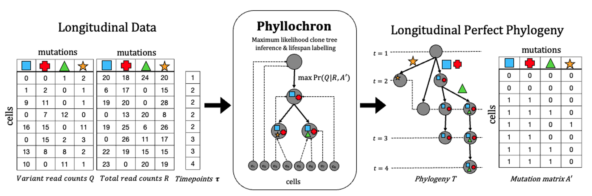

# Phyllochron (Maximum Likelihood Assignment for Longitudinal Reconstruction)

<!--  -->
Phyllochron employs an ILP to solve the Maximum Likelihood Longitudinal Assignment Problem to infer a Longitudinally Observed Perfect Phylogeny Time-Labelled Matrix.

Phyllchron takes as input: 
* Variant and total read counts associated with each cell
* Discrete timepoints associated with each cell
* A perfect phylogeny clone tree
* A fractional threshold representing the minimum proportion of cells at a sample assigned to a clone for that clone to be present in that sample

## Contents

  1. [Pre-requisites](#pre-requisites)
  2. [Usage instcructions](#usage)
     * [I/O formats](#io)
     * [Phyllochron](#Phyllochron)

## Pre-requisites (see .yaml file for versions)
+ python3 (>= 3.6.10)
+ [numpy](https://numpy.org/doc/)
+ [pandas](https://pandas.pydata.org/pandas-docs/stable/index.html)
+ [gurobipy](https://www.gurobi.com/documentation/9.0/quickstart_mac/py_python_interface.html)
+ [networkx](https://networkx.org/)
+ [scipy](https://scipy.org/)
+ (for generating simulation and real data instances) [snakemake (>=5.2.0)](https://snakemake.readthedocs.io)

## Usage instructions

### I/O formats
The input for Phyllochron is 
* A comma-delimited file, which has on each line the variant read counts associated with a single cell for each mutation locus.
    * Example: `data/AML/input_data/AML-63_variant_readcounts.csv`
* A comma-delimited file, which has on each line the total read counts associated with a single cell for each mutation locus.
    * Example: `data/AML/input_data/AML-63_total_readcounts.csv`
Alternatively, instead of readcount information, Phyllochron can also take in a character matrix as input.
* A comma-delimited file, which has on each line the character state associated with a single cell for each mutation locus.
    * Example: `data/AML/input_data/AML-63_character_matrix.csv`

* A comma-delimited file, which has on each line the timepoint associated with each cell.
    * Example: `data/AML/input_data/AML-63_timepoints.csv`
* A comma-delimited file, which has on each line has an edge of the input mutation tree `m_1, m_2` representing the edge from mutation `m_1` to `m_2`. This tree is rooted at vertex `root`. 
    * Example: `data/AML/input_data/AML-63_mutation_tree.csv`
* A fractional threshold `z` representing the minimum proportion of cells at a sample assigned to a clone for that clone to be present in that sample. For example, `z = 0.10` means that at least 10% of cells in a sample must be assigned to a clone for it to be present in that sample.

### Phyllochron

    usage: phyllochron.py [-i CHARACTER_MATRIX] [-t TIMEPOINTS] [-o OUTPUT_PREFIX] [-z Z] [-a FP] [-b FN] [--ado ADO] [--time-limit TIME_LIMIT]

    required arguments:
      -i CHARACTER_MATRIX   filepath for the character matrix csv file     
      or
      -r TOTAL_READS   filepath for the total read counts csv file     
      -v VARIANT_READS   filepath for the variant read counts csv file     
      and
      -t TIMEPOINTS   filepath for the timepoints file  
      -o OUTPUT_PREFIX filepath indicating the output prefix for all output files
    optional arguments:
      -z Z  fractional clonal presence threshold. Default is z = 0.05 
      -a FP false positive error rate. Default is a = 0.001
      -b FN false negative error rate. Default is b = 0.001
      --ado ADO precision parameter for ADO. Default is ado = 15
      --time-limit TIME_LIMIT time limit for solver in seconds. Default is 1800 seconds

An example of usage is as follows. This command can be run from the directory that contains this README file.

    python src/phyllochron.py -r data/AML/input_data/AML-63_total_readcounts.csv -v data/AML/input_data/AML-63_variant_readcounts.csv -t data/AML/input_data/AML-63_timepoints.csv -o data/AML/output_data/AML-63 -z 0.05 -a 0.01 -b 0.038 --ado 15 --time-limit 1000

### Data
Currently, the csv files encoding the AML-63 & AML-97 readcount data are stored in `data/AML/input_data` and the Phyllochron inferred cell assignments are stored in `data/AML/output_data`.
